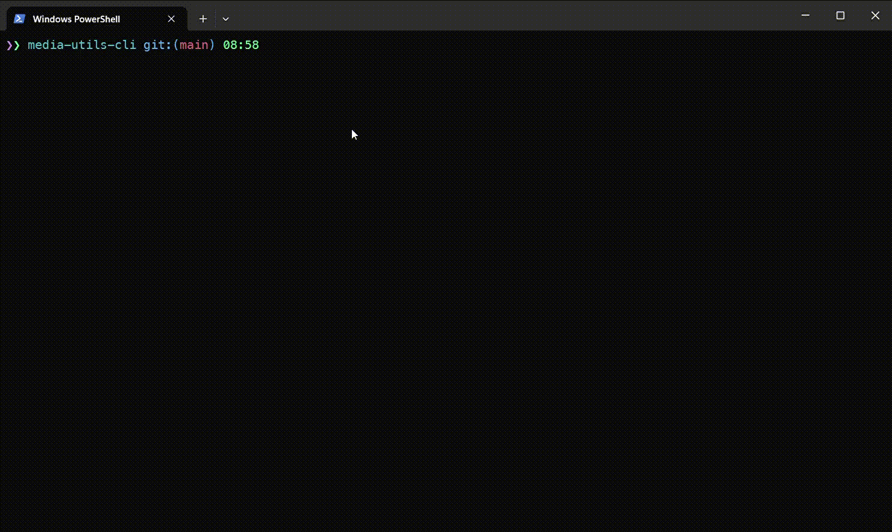

# media-utils-cli [![NPM version][npm-image]][npm-url]

> Media utils for different kinds of files (video, audio, images, pdf files) - transforming, converting, resizing, image manipulations, etc.

## Install

```bash
$ npm install --global media-utils-cli
```

## CLI

```
$ media-utils-cli
```

## Demo



## Notes

In order to use video utils you should have [ffmpeg](https://ffmpeg.org/) installed in your system.

## What's under the hood?

- [jimp](https://github.com/jimp-dev/jimp) - to manipulate over image files
- [pdf-lib](https://github.com/Hopding/pdf-lib) - to do pdf documents manipulations

## License

MIT © [Rushan Alyautdinov](https://github.com/akgondber)

[npm-image]: https://img.shields.io/npm/v/media-utils-cli.svg?style=flat
[npm-url]: https://npmjs.org/package/media-utils-cli
